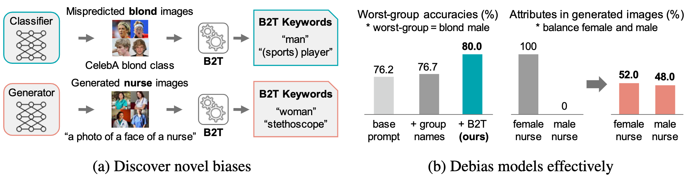
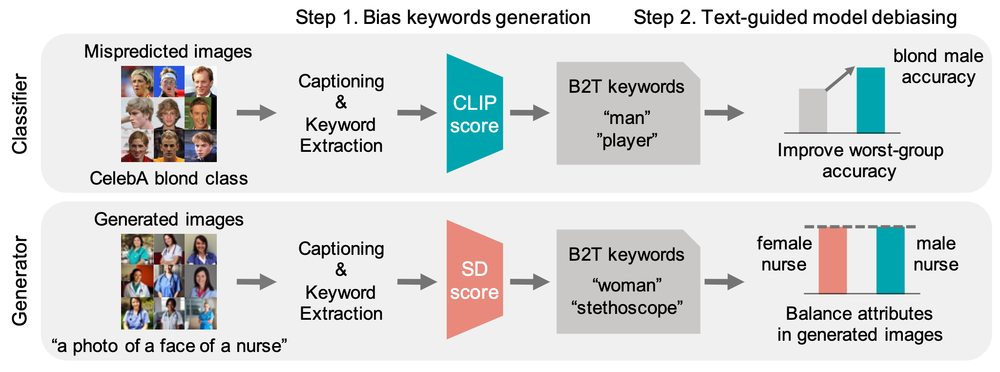

# Bias-to-Text (B2T): Visual Biases as Keywords

Implementation of the bias-to-text (B2T) algorithm described in ["**Bias-to-Text: Debiasing Unknown Visual Biases through Language Interpretation**."](https://arxiv.org/abs/2301.11104)
B2T identifies and mitigates visual biases in image classifiers and text-to-image generative models using language descriptions.


## Example Results

See the [**link**](./docs/more_results.MD) for more detailed results in bias discovery and debiasing.

## Method Overview



## Installation

Download datasets.
- [CelebA](http://mmlab.ie.cuhk.edu.hk/projects/CelebA.html)
- [Waterbirds](https://nlp.stanford.edu/data/dro/waterbird_complete95_forest2water2.tar.gz) (direct downloadable link), formed from Caltech-UCSD Birds 200 + Places

Clone our repository.  
```bash
$ git clone https://github.com/Erena-Kim/b2t.git
```

Run below to create virtual environment for ```b2t```  and install all prerequisites.
```bash
$ pip install pipenv
$ pipenv --python 3.8
$ pipenv install
```

To run our code, you need to place datasets and model checkpoints to right directory.  
You can download the ClipCap pretrained model [here](https://github.com/rmokady/CLIP_prefix_caption) and place the model to ```[root_dir]/function```. (Note that our paper uses the model that trained on Conceptual Captions)  
The main point of entry to the code is ```b2t.py```

## Arguments
- ```dataset```: ```celeba``` or ```waterbird```
- ```model```: download pretrained checkpoints of CelebA and Waterbirds [here](https://worksheets.codalab.org/worksheets/0x621811fe446b49bb818293bae2ef88c0) and put them into ```[root_dir]/model```    
  - [best_model_CelebA_erm.pth](https://worksheets.codalab.org/rest/bundles/0x227a9d64524a46e29e34177b8073cb44/contents/blob/logs/best_model.pth)
  - [best_model_CelebA_dro.pth](https://worksheets.codalab.org/rest/bundles/0xa7c89242d1c1442d8c9b94902469ba15/contents/blob/logs/best_model.pth) 
  - [best_model_Waterbirds_erm.pth](https://worksheets.codalab.org/rest/bundles/0x677545cb487b4c98831e70b16ff836e7/contents/blob/logs/best_model.pth)
  - [best_model_Waterbirds_dro.pth](https://worksheets.codalab.org/rest/bundles/0x365690114c2e4b369c489314fdae7e99/contents/blob/logs/best_model.pth)
- ```extract_caption```: ```True``` or ```False```
  - If set ```True```, automatically generate ```[root_dir]/data/[dataset]/caption/``` and store extracted captions there
- ```save_result```: ```True``` or ```False```
  - If set ```True```, automatically generate ```[root_dir]/diff/``` and store csv file of results there

## CelebA
Our code expects the following files/folders in the ```[root_dir]/data/celebA``` directory:
- ```data/list_eval_partition.csv```
- ```data/list_attr_celeba.csv```
- ```data/image_align_celeba/```


A sample command to run ```b2t``` on CelebA with pretrained erm model is:
```bash
$ python b2t.py --dataset celeba --model best_model_CelebA_erm.pth
```

## Waterbirds
Our code expects the following files/folders in the ```[root_dir]/data/cub``` directory:
- ```data/waterbird_complete95_forest2water2/```

A sample command to run ```b2t``` on Waterbirds with pretrained erm model is:
```bash
$ python b2t.py --dataset waterbird --model best_model_Waterbirds_erm.pth
```

## Debiasing classifiers with B2T
To reproduce the debiasing classifier experiments, see [b2t_debias](b2t_debias).  


## Diffusion models with B2T
To reproduce the diffusion model experiments, see [b2t_diffusion](b2t_diffusion).  
